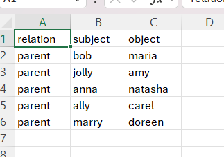
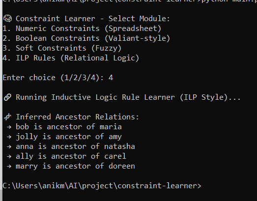

# 🧠 Constraint Learner

A modular project to learn different types of constraints from examples — inspired by the paper _"Learning Constraints from Examples"_ by Luc De Raedt et al.

---

## 📦 Modules Included

- **Boolean Constraints (Valiant-style)** — learns logical rules from binary data
- **Numeric Spreadsheet Constraints** — infers formulas like `Total = A + B + C`
- **Soft Constraints** — supports approximate relationships using scoring
- **ILP (Inductive Logic Programming)** — learns symbolic rules (e.g., ancestor from parent)
- **CLI + Streamlit UI** — for interaction and visualization

---

## 🚀 How to Run

### 1. Install Requirements
```bash
pip install pandas sympy streamlit pyDatalog
```

### 2. Run from CLI
```bash
python main.py
```

### 3. Run the Web Interface
```bash
streamlit run ui/streamlit_app.py
```

---

## 📂 Folder Structure
```
constraint-learner/
├── main.py                   # Main entry point
├── learner/
│   ├── boolean_valiant.py    # Boolean constraint learning
│   ├── numeric_constraints.py # Numerical formula inference
│   ├── soft_constraints.py   # Approximate constraint learning
│   └── ilp_rules.py          # Inductive logic programming
├── ui/
│   ├── cli.py                # Command-line interface
│   └── streamlit_app.py      # Web interface
├── data/
│   ├── sample.csv            # Example data for basic constraints
│   └── relational_data.csv   # Sample data for ILP learning
└── README.md
```

---

## 🔍 Key Features

- **Data-Driven Learning** — automatically infers constraints from examples
- **Interactive Visualization** — see constraints as they're learned
- **Multiple Paradigms** — boolean, numeric, relational, and soft constraints
- **Export Options** — save learned constraints in various formats (JSON, Python, SQL)
- **Extensible Architecture** — easily add new constraint types

---

## 💡 Example Use Cases

- **Data Validation** — discover business rules from existing data
- **Knowledge Discovery** — uncover hidden patterns and relationships
- **Automated Formula Inference** — reconstruct spreadsheet formulas
- **Rule Learning** — extract logical rules from relational databases

---

## 📊 Example
### relational_data.csv

### main.py: 

```python
from learner.numeric_constraints import NumericConstraintLearner

# Sample data# constraint_learner/main.py

from learner import numeric_constraints, boolean_valiant, soft_constraints, ilp_rules
from pyDatalog import pyDatalog

if __name__ == "__main__":
    print("\n🧠 Constraint Learner - Select Module:")
    print("1. Numeric Constraints (Spreadsheet)")
    print("2. Boolean Constraints (Valiant-style)")
    print("3. Soft Constraints (Fuzzy)")
    print("4. ILP Rules (Relational Logic)")

    choice = input("\nEnter choice (1/2/3/4): ")

    if choice == "1":
        numeric_constraints.run()
    elif choice == "2":
        boolean_valiant.run()
    elif choice == "3":
        soft_constraints.run()
    elif choice == "4":
        ilp_rules.run()
    else:
        print("Invalid choice")

```
### expected outcome:

---

## 🛠️ Advanced Configuration

Configuration options can be set in `config.json`:

```json
{
  "learning": {
    "min_support": 0.8,
    "max_complexity": 5
  },
  "output": {
    "format": "python",
    "verbose": true
  }
}
```

---

## 📚 Credits

Based on ideas from the paper **"Learning Constraints from Examples"** by Luc De Raedt et al.

## 📄 License

MIT